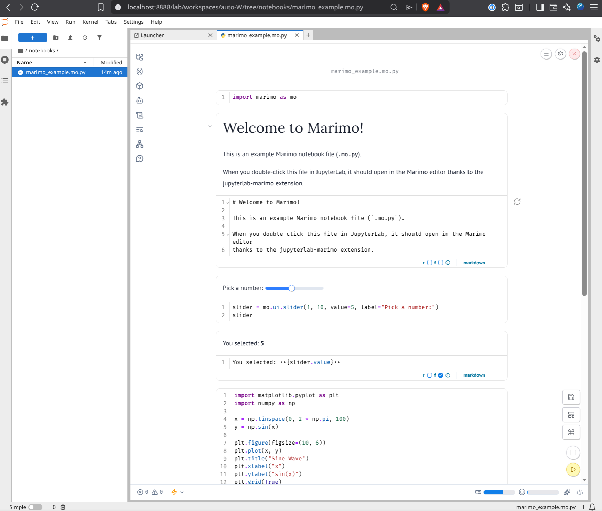

# JupyterLab Marimo Extension

> [!WARNING]
> **This extension is legacy and no longer actively maintained.**
>
> An official Marimo Jupyter extension is now available at **https://github.com/marimo-team/marimo-jupyter-extension**.
> We recommend using the official extension instead.

A JupyterLab extension that automatically opens Marimo notebooks in the Marimo editor instead of the default text editor or notebook interface.



## Features

- **Automatic File Type Registration**: Registers `.mo.py` files as a custom file type in JupyterLab
- **Seamless Integration**: Double-click `.mo.py` files in the file browser to open them directly in Marimo
- **Embedded Editor**: Displays the Marimo editor in an iframe within JupyterLab
- **Error Handling**: Provides clear error messages if Marimo or the proxy is not available
- **Context Menu**: Right-click on `.mo.py` files to open them in Marimo

## Installation

### User Installation (from PyPI)

Install the extension with a single command:

```bash
pip install jupyterlab-marimo
```

Or with `uv`:

```bash
uv pip install jupyterlab-marimo
```

This will automatically install all dependencies including:
- Marimo (>= 0.6.21)
- jupyter-server-proxy
- JupyterLab extension files

Then start JupyterLab:

```bash
jupyter lab
```

The extension will be automatically enabled!


## Usage

1. **Open JupyterLab**:
   ```bash
   jupyter lab
   ```

2. **Create or navigate to a `.mo.py` file**:
   - Create a new file with the `.mo.py` extension
   - Or navigate to an existing Marimo notebook

3. **Open the file**:
   - Double-click the `.mo.py` file in the file browser
   - Or right-click and select "Open in Marimo"

4. **The Marimo editor will open** in an embedded iframe within JupyterLab

## How It Works

The extension:

1. Registers `.mo.py` as a custom file type in JupyterLab
2. Creates a custom widget factory that handles `.mo.py` files
3. Embeds the Marimo editor in an iframe using the `jupyter-marimo-proxy` service
4. Constructs a proxied URL in the format: `/marimo/?file=<path>`
5. Passes the file path to Marimo for editing

## Troubleshooting

### Extension Not Loading

If the extension doesn't appear to be working:

1. **Check that the extension is installed**:
   ```bash
   jupyter labextension list
   ```
   You should see `marimo-jupyterlab-extension` in the list.

2. **Rebuild JupyterLab**:
   ```bash
   jupyter lab build
   ```

3. **Clear browser cache and restart JupyterLab**

### Marimo Proxy Not Available

If you see an error about the Marimo proxy not being available:

1. **Verify Marimo is installed**:
   ```bash
   pip show marimo
   ```

2. **Verify jupyter-server-proxy is installed**:
   ```bash
   pip show jupyter-server-proxy
   ```

3. **Check that the proxy is running**:
   - Open your browser's developer console (F12)
   - Look for any network errors related to `/marimo/`

4. **Restart JupyterLab** after installing dependencies

### File Path Issues

If the file doesn't open correctly:

- Ensure the file path is correct and the file exists
- Check the browser console for detailed error messages
- Verify that the file has the `.mo.py` extension

### Alternative URL Patterns

The extension tries to use the URL pattern `/marimo/?file=<path>`. If your `jupyter-marimo-proxy` configuration uses a different pattern, you may need to modify the URL construction in `src/index.ts` (line ~70).

Common patterns:
- `/marimo/?file=<path>` (default)
- `/marimo/edit?file=<path>`
- `/proxy/absolute/<port>/marimo/edit?file=<path>`

## Uninstallation

If you installed from PyPI:

```bash
pip uninstall jupyterlab-marimo
```

If you installed in development mode:

```bash
jupyter labextension develop --uninstall .
```

## License

Apache-2.0

## Credits

This extension is designed to work with:
- [Marimo](https://github.com/marimo-team/marimo) - A reactive Python notebook

This extension includes code borrowed from:
- [jupyter-marimo-proxy](https://github.com/jyio/jupyter-marimo-proxy) by Jiang Yio - Jupyter server proxy configuration for Marimo (Apache-2.0 license)
